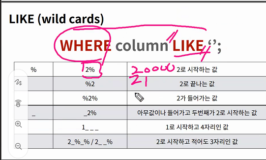

```bash

이도건@DESKTOP-FHDGE77 MINGW64 ~/Desktop/04_db/00_sql
$ ls
hellodb.csv  users.csv

이도건@DESKTOP-FHDGE77 MINGW64 ~/Desktop/04_db/00_sql
$ sqlite3
SQLite version 3.33.0 2020-08-14 13:23:32
Enter ".help" for usage hints.
Connected to a transient in-memory database.
Use ".open FILENAME" to reopen on a persistent database.
sqlite>
이도건@DESKTOP-FHDGE77 MINGW64 ~/Desktop/04_db/00_sql
$ sqlite3 tutorial.sqlite3
SQLite version 3.33.0 2020-08-14 13:23:32
Enter ".help" for usage hints.
sqlite> .mode csv
sqlite> .mode
current output mode: csv
sqlite> .import hellodb.csv examples
sqlite> SELECT * FROM examples;
1,"길동","홍",600,"충청도",010-2424-1232
sqlite> .headers on
sqlite> SELECT * FROM examples;
id,first_name,last_name,age,country,phone
1,"길동","홍",600,"충청도",010-2424-1232
sqlite> .mode column
sqlite> SELECT * FROM examples;
id  first_name  last_name  age  country  phone
--  ----------  ---------  ---  -------  -------------
1   길동          홍          600  충청도      010-2424-1232
sqlite> CREATE TABLE classmates (
   ...> id INTEGER PRIMARY KEY,
   ...> name TEXT
   ...> );
sqlite> .tables
classmates  examples
sqlite> .schema classmates
CREATE TABLE classmates (
id INTEGER PRIMARY KEY,
name TEXT
);
sqlite> DROP TABLE classmates;
sqlite> .tables
examples
sqlite> CREATE TABLE classmates (
   ...> name TEXT,
   ...> age INT,
   ...> address TEXT
   ...> );
sqlite> .tables
classmates  examples
sqlite> .schema classmates
CREATE TABLE classmates (
name TEXT,
age INT,
address TEXT
);
sqlite> INSERT INTO classmates (name, age)
   ...> VALUES ('홍길동', 23);
sqlite> SELECT * FROM classmates;
name  age  address
----  ---  -------
홍길동   23
sqlite> INSERT INTO classmates (name, age, address)
   ...> VALUES ('홍길동', 30, '서울);
   ...>
   ...> VALUES ('홍길동', 30, '서울');
   ...> ;
   ...> ;
   ...> ');
Error: near "홍길동": syntax error
sqlite> INSERT INTO classmates (name, age, address)
   ...> VALUES ('홍길동', 30, '서울');
sqlite> SELECT * FROM classmates;
name  age  address
----  ---  -------
홍길동   23
홍길동   30   서울
sqlite> SELECT rowid, * FROM classmates;
rowid  name  age  address
-----  ----  ---  -------
1      홍길동   23
2      홍길동   30   서울
sqlite> DROP TABLE classmates;
sqlite> .tables
examples
sqlite> CREATE TABLE classmates (
   ...> id INTEGER PRIMARY KEY,
   ...> name TEXT NOT NULL,
   ...> age INT NOT NULL,
   ...> address TEXT NOT NULL
   ...> );
sqlite> .tables
classmates  examples
sqlite> .schema classmates
CREATE TABLE classmates (
id INTEGER PRIMARY KEY,
name TEXT NOT NULL,
age INT NOT NULL,
address TEXT NOT NULL
);
sqlite> INSERT INTO classmates (id, name, age, address)
   ...> VALUES ('');
Error: 1 values for 4 columns
sqlite> INSERT INTO classmates (name, age, address)
   ...> VALUES ('홍길동, 23, '서울');
   ...> ');
Error: near "서울": syntax error
sqlite> INSERT INTO classmates (name, age, address)
   ...> VALUES ('홍길동', 23, '서울');
sqlite> SELECT * FROM classmates;
id  name  age  address
--  ----  ---  -------
1   홍길동   23   서울
sqlite> INSERT INTO classmatesVALUES (2, '홍길동', 30, '대전');
Error: near "2": syntax error
sqlite> INSERT INTO classmatesVALUES (2, '홍길동', 30, '대전');
Error: near "2": syntax error
sqlite> DROP TALE classmates;
Error: near "TALE": syntax error
sqlite> DROP TABLE classmates;
sqlite> .tables
examples
sqlite> CREATE TABLE classmates (
   ...> name TEXT NOT NULL,
   ...> age INT NOT NULL,
   ...> address TEXT NOT NULL
   ...> );
sqlite> .tables
classmates  examples
sqlite> .schema classmates
CREATE TABLE classmates (
name TEXT NOT NULL,
age INT NOT NULL,
address TEXT NOT NULL
);
sqlite> INSERT INTO classmates VALUES('홍길동', 30,
   ...> '서울'), ('김철수', 23, '대전'), ('박나래', 23, '광주);
   ...> ');
sqlite> SELECT rowid, * FROM classmates;
rowid  name  age  address
-----  ----  ---  -------
1      홍길동   30   서울
2      김철수   23   대전
3      박나래   23   광주);

sqlite> SELECT rowid, name FROM classmates;
rowid  name
-----  ----
1      홍길동
2      김철수
3      박나래
sqlite> SELECT rowid, name FROM classmates LIMIT 1;
rowid  name
-----  ----
1      홍길동
sqlite> SELECT rowid, name FROM classmates LIMIT 2;
rowid  name
-----  ----
1      홍길동
2      김철수
sqlite> SELECT rowid, name FROM classmates LIMIT 1
   ...> OFFSET 2;
rowid  name
-----  ----
3      박나래
sqlite> SELECT rowid, name FROM classmates
   ...> WHERE adress='서울';
Error: no such column: adress
sqlite> SELECT rowid, name FROM classmates
   ...> WHERE address='서울';
rowid  name
-----  ----
1      홍길동
sqlite> SELECT DISTINCT age FROM classmates;
age
---
30
23
sqlite> DELETE FROM classmates WHERE rowid=3;
sqlite> SELECT * FROM classmates;
name  age  address
----  ---  -------
홍길동   30   서울
김철수   23   대전
sqlite> INSERT INTO classmates VALUES ('박서연', 25, '보령');
sqlite> SELECT * FROM classmates;
name  age  address
----  ---  -------
홍길동   30   서울
김철수   23   대전
박서연   25   보령
sqlite> SELCET rowid, * from classmates;
Error: near "SELCET": syntax error
sqlite> SELECT rowid, * from classmates;
rowid  name  age  address
-----  ----  ---  -------
1      홍길동   30   서울
2      김철수   23   대전
3      박서연   25   보령
sqlite> INSERT INTO classmates VALUES ('이도건', 27, '청주');
sqlite> SELECT rowid, * from classmates;
rowid  name  age  address
-----  ----  ---  -------
1      홍길동   30   서울
2      김철수   23   대전
3      박서연   25   보령
4      이도건   27   청주
sqlite> UPDATE classmates SET name='홍길동', address='제주도'
   ...> WHERE = rowid=1;
Error: near "=": syntax error
sqlite> UPDATE classmates SET name='홍길동', address='제주도'
   ...> WHERE rowid = 1;
sqlite> SELECT rowid, * from classmates;
rowid  name  age  address
-----  ----  ---  -------
1      홍길동   30   제주도
2      김철수   23   대전
3      박서연   25   보령
4      이도건   27   청주
sqlite>

```

